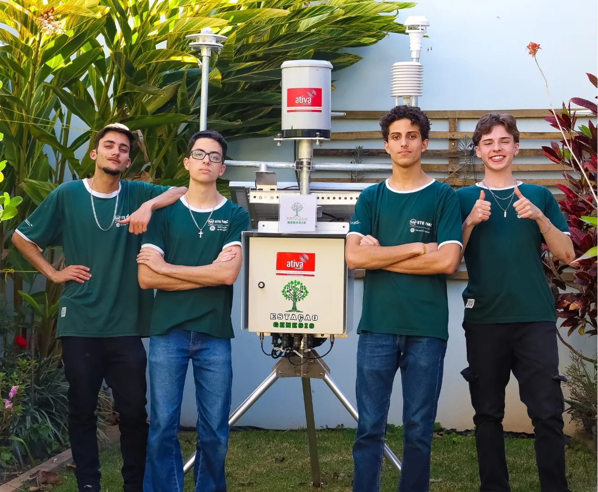

# Genesis Station

The **Genesis Station** is an innovative weather station developed for **ProjETE 2K24**, a technological project fair held annually by **ETE FMC**, the first technical school in Latin America.  
The project was created to autonomously collect climatic data, providing accurate weather forecasts while eliminating the dependence on low-precision sensors or complex human interpretations.  
Initially designed for agribusiness, the Genesis Station is versatile and can be applied to tourism, transportation, and public administration, promoting sustainability, efficient resource management, and reduced damage from natural disasters.

 

  

 

---

## Project Functionality

Powered by solar panels and batteries, which not only reduce operational costs but also make the solution more sustainable by promoting an environmentally conscious approach, the **Genesis Station** collects local weather data such as temperature, pressure, humidity, wind speed and direction, rainfall, solar and UV radiation, and location, using high-quality and precision sensors provided by **Ativa Soluções**, one of the best companies in this field in Brazil.

These devices are operated within the weather station by a **LoRa32 V2** (ESP-32) from Heltec, the microcontroller chosen by the team to extract data from the sensors mentioned via one of three methods: RS485, digital, or current, and process it.

Once processed, the information collected by the project is sent to a local server via LoRa (Long Range), using an alternative and innovative network architecture called **Nova Genesis**, developed at **INATEL** by Professor **Antônio Marcos Alberti**. This architecture operates in a PUB/SUB model, where network protocols discover each other, establish service offers, and then work together to perform specific functions. This architecture, which also includes device addressability based on their hash, protocol self-discovery, and some concepts from distributed networks, promises to solve several issues in communication as we know it, turning Genesis Station, an IoT (Internet of Things) project, into an FIoT (Future Internet of Things) project.

Upon reaching the server, the data is processed by the project's AI, an **LSTM** (Long Short Term Memory) neural network developed in Python with TensorFlow, an architecture similar to the LLMs used in the most popular human language chat models, such as ChatGPT, Gemini, and Colab.

After completing all predictions, the data is stored in a **MySQL database** created by the team and then made available and displayed on the project website via a **dashboard** (a set of interactive charts), a **digital twin** (a virtual simulation of the weather station, where real-world events influence the digital twin and vice versa, facilitating maintenance and preparing it for technological innovations such as the Metaverse), and a **chatbot** (developed using OpenAI's API), which interacts with the project's data and answers user questions about everything they want to know about Genesis Station.

To learn more about the project, visit the Genesis Station's logbook link, a document created throughout the development process by the team with photos, videos, files, and versions of the codes used, or watch the video recorded by the group.
- [Logbook](https://powerful-borogovia-5d3.notion.site/Di-rio-de-Bordo-b80a633d32ad4d6d85510eee0a9d1a12)
- [Video](https://youtu.be/wb_kGaT5vpk?si=zksXfxjZhVxrBi8B)

---

## Technologies Used

### Software:
- Artificial Intelligence: Supervised LSTM (Long Short Term Memory) neural network
- NovaGenesis: Innovative and disruptive network architecture
- LoRa: Long-distance RF communication
- Web Interface: Interactive dashboard, Digital Twin, and Chatbot
- Database: MySQL 

### Hardware:
- Processing: Heltec LoRa32 V2 (ESP-32)
- Sensing: RS485, digital, and current sensors
- Power Supply: Solar panels, batteries, and charge controllers
- Protection: Surge suppressors and fuses

### Languages and Libraries:
- Programming Languages: Python, C++, C, HTML5, CSS3, JavaScript, SQL
- Libraries and Frameworks:
  - AI: TensorFlow, Keras, Scikit-learn
  - Data Analysis: Pandas, NumPy, Matplotlib
  - Big Data and Visualization: ApexCharts, Three.js
  - Chatbot: OpenAI
- Protocols and Technologies: RS485, LoRa

---

## Achievements

The **Genesis Station** was highlighted at **ProjETE 2K24**, winning the awards:
- **FAI Entrepreneurial Project**: Innovation and commercial viability
- **Best Telecommunications Project**: Technological impact
- **Municipal Innovation Project**: Sustainable local development

---

## Founders

- **Julio Cesar** - Front-End Developer  
  [LinkedIn](https://www.linkedin.com/in/julio-cesar-magalhães-3a3542277/) | [GitHub](https://github.com/PkJulioETE)  
- **Kauã Ribeiro** - Leader - Back-End and AI Developer  
  [LinkedIn](https://www.linkedin.com/in/kaua-ribeiro17/) | [GitHub](https://github.com/Kauakim)  
- **Victor Alberti** - Innovation - NovaGenesis and LoRa Developer  
  [LinkedIn](https://www.linkedin.com/in/victor-alexandre-de-jesus-alberti-328686288/) | [GitHub](https://github.com/Scalifax)  
- **Samuel Vono** - MySQL Developer  
  [LinkedIn](https://www.linkedin.com/in/samuel-vono/) | [GitHub](https://github.com/Samelkk)  

---

**Acknowledgments**  
The project was supported by **Ativa Soluções**, which provided high-precision equipment, and **ETE-FMC**, with guidance from Professors **Alan Lemes** and **Ana Letícia Gomes Gonçalves**.
