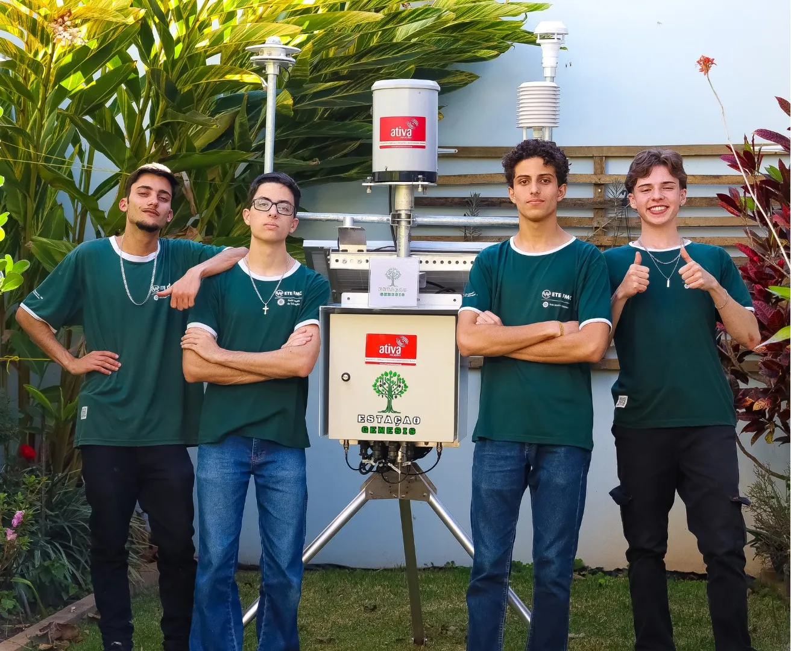

# Estação Genesis

A **Estação Genesis** é uma estação meteorológica inovadora desenvolvida para a **ProjETE 2K24**, uma feira de projetos tecnológicos realizada anualmente pela **ETE FMC**, a primeira escola técnica da América Latina.  
O projeto foi criado para coletar dados climáticos de forma autônoma, fornecendo previsões meteorológicas precisas e eliminando a dependência de sensores de baixa precisão ou interpretações humanas complexas.  
Inicialmente projetada para o agronegócio, a Estação Genesis é versátil e pode ser aplicada em turismo, transporte e administração pública, promovendo sustentabilidade, eficiência na gestão de recursos e redução de danos por desastres naturais.

 

  

 

---

## Funcionamento do projeto

Alimentada via painéis solares e baterias, que não só reduzem os custos operacionais como também tornam a solução mais sustentável, pois promovem uma abordagem ambientalmente consciente, a **Estação Genesis** coleta as informações do tempo de um local, como temperatura, pressão, umidade, velocidade e direção do vento, pluviometria, radiação solar e UV e localização, por meio da utilização dos sensores de altíssima qualidade e precisão fornecidos pela **Ativa Soluções**, uma das melhores empresas desse tipo de equipamento em todo o país, à equipe.

Esses equipamentos são operados na estação meteorológica por um **LoRa32 V2** (ESP-32) da Heltec, o microcontrolador escolhido pelo grupo para ser utilizado no produto, responsável por extrair as informações dos sensores citados de uma de três maneiras diferentes: RS485, digital ou por corrente, e processá-las.

Após processadas, as informações adquiridas pelo projeto são então enviadas para um servidor localmente via LoRa (Long Range), por meio de uma arquitetura de rede alternativa e inovadora, a **Nova Genesis**, projeto desenvolvido no **INATEL** pelo professor **Antônio Marcos Alberti**, que opera no estilo PUB/SUB, no qual os protocolos de rede se descobrem, estabelecem ofertas de serviço e então passam a trabalhar em conjunto para realizarem determinadas funções. Toda essa arquitetura, que ainda conta com o endereçamento baseado no Hash dos dispositivos, a autodescoberta de protocolos e alguns dos conceitos das redes distribuídas, promete solucionar diversos problemas da comunicação como conhecemos, transformando a Estação Genesis, um projeto IoT (Internet of Things), em um projeto FIoT (Future Internet of Things).

Ao chegarem no servidor, as informações são então utilizadas pela IA do projeto, uma rede neural **LSTM** (Long Short Term Memory) desenvolvida em Python com Tensorflow, uma arquitetura similar às LLMs utilizadas nos chats de linguagem humana mais famosos, como o ChatGPT, Gemini e Colab.

Finalizadas todas essas previsões, os dados são finalmente armazenados em um **banco de dados** MySQL criado pela equipe e então disponibilizados e exibidos no site do projeto via **dashboard**, um conjunto de gráficos interativos, **gêmeo digital**, uma simulação virtual da estação meteorológica, na qual os eventos que ocorrem no mundo real influenciam o digital, e vice-versa, facilitando sua manutenção e a preparando para diversas inovações tecnológicas como o Metaverso, ou **chatbot**, desenvolvido a partir do ChatGPT, disponibilizado pela API da OpenAI, que interage com os dados do projeto e responde aos usuários sobre tudo aquilo que quiserem saber acerca da Estação Genesis.

Para saber mais sobre o projeto, acesse o link do diário de bordo da Estação Genesis, documento desenvolvido ao longo de todo o processo de desenvolvimento do projeto pela equipe com fotos, vídeos, arquivos e versões dos códigos utilizados, ou assista ao vídeo gravado pelo grupo.
- [Diário de Bordo](https://powerful-borogovia-5d3.notion.site/Di-rio-de-Bordo-b80a633d32ad4d6d85510eee0a9d1a12)
- [Vídeo](https://youtu.be/wb_kGaT5vpk?si=zksXfxjZhVxrBi8B)

---

## Tecnologias Utilizadas

### Software:
- Inteligência Artificial: Rede neural supervisionada LSTM (Long Short Term Memory)
- NovaGenesis: Arquitetura de rede inovadora e disruptiva
- LoRa: Comunicação RF de longa distância
- Interface Web: Dashboard interativo, Gêmeo digital e Chatbot
- Banco de Dados: MySQL 

### Hardware:
- Processamento: Heltec LoRa32 V2 (ESP-32)
- Sensoriamento: Sensores RS485, digital e por corrente
- Alimentação: Painéis solares, baterias e controlador de carga
- Proteção: Supressores de surto e fusíveis

### Linguagens e Bibliotecas:
- Linguagens de Programação: Python, C++, C, HTML5, CSS3, JavaScript, SQL
- Bibliotecas e Frameworks:
  IA: TensorFlow, Keras, Scikit-learn
  Análise de Dados: Pandas, NumPy, Matplotlib
  Big Data e Visualização: ApexCharts, Three.js
  Chatbot: OpenAI
- Protocolos e Tecnologias: RS485, LoRa

---

## Reconhecimentos

A **Estação Genesis** recebeu destaque na **ProjETE 2K24**, conquistando os prêmios:
- **Projeto Empreendedor da FAI**: Inovação e viabilidade comercial
- **Melhor Projeto de Telecomunicações**: Impacto tecnológico
- **Projeto Inovação Municipal**: Desenvolvimento local sustentável

---

## Fundadores

- **Julio Cesar** - Desenvolvedor front-end  
  [LinkedIn](https://www.linkedin.com/in/julio-cesar-magalhães-3a3542277/) | [GitHub](https://github.com/PkJulioETE)  
- **Kauã Ribeiro** - Líder - Desenvolvedor back-end e IA  
  [LinkedIn](https://www.linkedin.com/in/kaua-ribeiro17/) | [GitHub](https://github.com/Kauakim)  
- **Victor Alberti** - Inovação - Desenvolvedor NovaGenesis e LoRa  
  [LinkedIn](https://www.linkedin.com/in/victor-alexandre-de-jesus-alberti-328686288/) | [GitHub](https://github.com/Scalifax)  
- **Samuel Vono** - Desenvolvedor MySQL  
  [LinkedIn](https://www.linkedin.com/in/samuel-vono/) | [GitHub](https://github.com/Samelkk)  

---

**Agradecimentos**  
O projeto contou com o apoio da **Ativa Soluções**, que forneceu equipamentos de alta precisão, e da **ETE-FMC**, com orientação dos professores **Alan Lemes** e **Ana Letícia Gomes Gonçalves**.  
